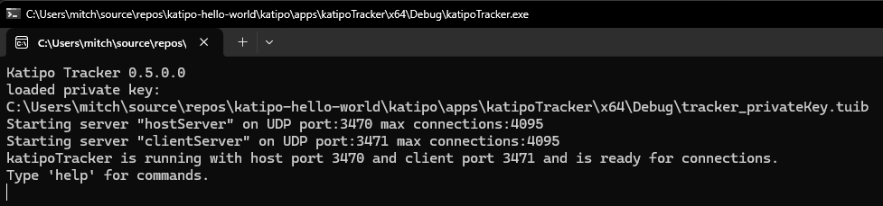
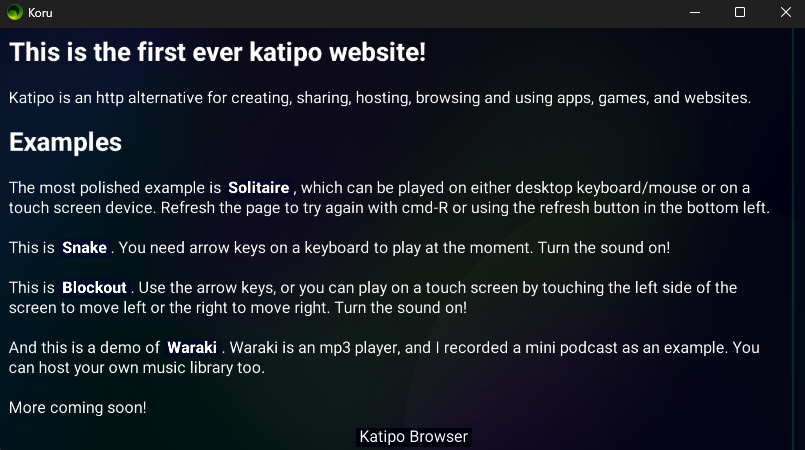
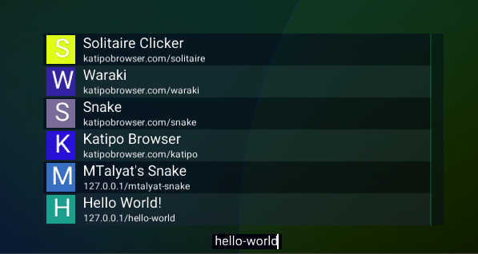
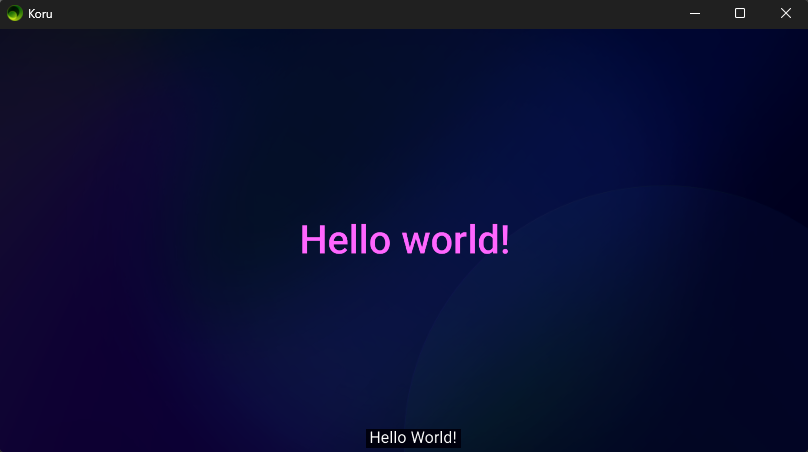

# Katipo Hello World

This is a Hello World! project for [katipo](https://github.com/mjdave/katipo), to quickly get new developers started. The goal of this repository is to show you how to set up a local server and use the Koru Browser ([katipoBrowser](https://github.com/mjdave/katipoBrowser)) to connect via a the tracker and view it.

Please refer to the README for katipo on how the Client, Server (Host) and Tracker work with one another.

## Guide

Please refer to the [README for katipo](https://github.com/mjdave/katipo/blob/main/README.md) on how the Client, Server (Host) and Tracker work with one another.

Prerequisites: Download and install the latest version of the Koru Browser from [https://github.com/mjdave/katipoBrowser/releases](https://github.com/mjdave/katipoBrowser/releases).

Steps:

1. Clone this repository
2. Update the submodules by running this in the terminal in the cloned repository's directory: `git submodule update --init --recursive`
3. Build katipo/apps/katipoClient
4. Build katipo/apps/katipoHost
5. Build katipo/apps/katipoTracker
6. Run the katipoTracker. This will run locally and allow the client (Kuro Browser) to talk to the host (hello-world).

7. Run the hello-world application. This can be accomplished by doing one of the following:
  * Run run_hello-world.bat (Windows)
  * Run run_hello-world.sh (Linux or Mac)
  * Run the katipoHost executable with "--site hello-world" as arguments
8. Run the Koru Browser

9. At the bottom of the browser, click the URL text and enter "hello-world"

10. The hello-world project will load in the browser. You are good to go!


## Breakdown

The following is an explanation of each significant part of the hello-world project.

### katipo

This is the katipo repository, which allows us to access the most recent versions of the client, host and tracker.

###  hello-world/code.tui

This is the tui file that handles the backend of the application (server).

```<tui>
siteInfo = require(katipo.sitePath + "/site.tui")
host = katipo.host

# Called just after katipo is initialized.
# The database is now ready to use.
init = function()
{
    print("hello-world init")
}

# Called when clients query this site
# url: The URL being requested by the client
# clientData: Data sent by the client with the request
get = function(url, clientData)
{
    print("hello-world get")
    return host.get(url, clientData)
}
```

### hello-world/site.tui

This is the tui file containing information about the site.

You will want to replace these fields with your information.

```<tui>
nameKey = "hello-world" # used to uniquely identify this site
title = "Hello World!" # displayed name
keywords = { "hello", "world", "example" } # used for search
description = "Hello world example" # used for search and more info
author = "unknown" # used for search and more info
```

### hello-world/clientSite

This directory contains the client files. This is what gets sent to and ran by the client when they connect.

*NOTE: print() does not work in the client tui files. Currently.*

### hello-world/clientSite/scripts/code.tui

This is the code for the client software. The primary use case here is to provide functionality when the client is loaded or updated.

```<tui>
# Called when the site is loaded
# wasNewDownload: true if an update was pulled from the site, false if running based on cached data
# publicData: TODO: add description...
katipo.onSiteLoad = function(wasNewDownload, publicData)
{
    
}

# Called every rendered frame. 
# dt: The time step
katipo.update = function(dt)
{

}
```

### hello-world/clientSite/scripts/scene.tui

This is scene configuration/code for the hello-world project. The primary use case here is to define objects in the scene.

```<tui>
mainView = {
    type = "color"
    color = vec4(0.0,0.0,0.5,0.1)
    onParentSizeChanged = function(parentSize)
    {
        return parentSize
    }
    subviews = {
        {
            id = "hello-world-text"
            type = "text"
            text = "Hello world!"
            font = "roboto"
            color = vec4(1.0,0.4,1.0,1.0)
            shader = "drawQuadTexturedHueShift"
            fontSize = 40
            hidden = false
        }
    }
}
```

## Resources

To get started on your project, here are some resources:

* [tui](https://github.com/mjdave/tui) the tui repository.
* [katipo](https://github.com/mjdave/katipo) the katipo repository.
* [Dave's katipo sites](https://github.com/mjdave/daves-katipo-sites) - a large set of example projects that the Katipo developer created.

Dave's katipo sites are currently the best resource for how to implement a project.
